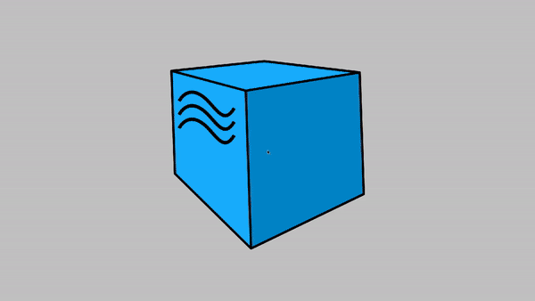
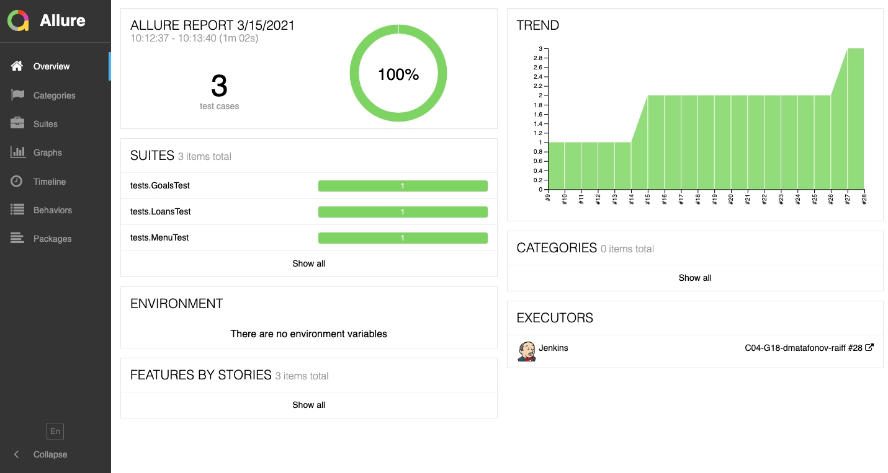
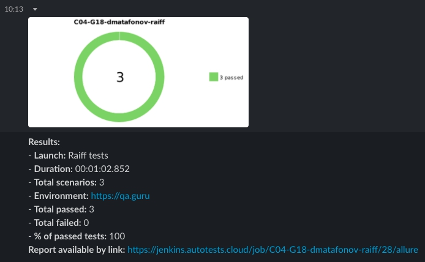

# Автотесты для демо-страницы Raiffeisen
- Создание финансовой цели
- Досрочное закрытие потребительского кредита
- Просмотр основных банковских операций

Сборка тестов на локальном окружении:

`clean test -Denv=local`

## Видео о прохождении тестов

## Отчёт в Allure

https://jenkins.autotests.cloud/job/C04-G18-dmatafonov-raiff/allure/

## Уведомления в Slack

